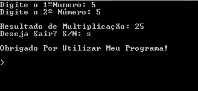

# Calculadora

Calculadora de operações básicas

## programa em execução

```
Digite o 1ºNumero: 5
Digite o 2º Número: 5

Resultado de Multiplicação: 25
Deseja Sair? S/N: s

obrigado! 
```

## print do programa em execução

 

## @download@

baixe o arquivo a seguir e o descompacte na pasta desejada.

[download do arquivo](dist/calculadora.rar)

##como executar

```
dotnet calculadora.dll
``` 

Caso você esteja utilizando windows, basta clicar 2x em `calculadora.exe`.

## Agradecimentos 

- [profºErmogenes](https://github.com/ermogenes)
- [profºNeri](https://github.com/diegoneri) 

---

Pirataria é crime. Diga não a falsidade!


